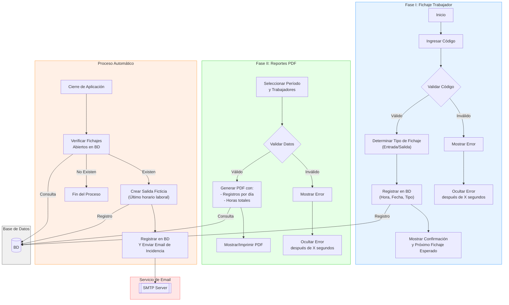

# Sistema de Fichaje y Reportes PDF

## Descripción

Este sistema es una aplicación de escritorio desarrollada en Python utilizando la librería PyQt para la interfaz gráfica. Su objetivo es gestionar el registro de fichajes de los trabajadores (entradas y salidas) y generar reportes en formato PDF que resuman la actividad diaria y las horas trabajadas. Además, incluye un proceso automático que, al cierre de la aplicación, verifica los fichajes abiertos, registra salidas ficticias cuando es necesario y envía notificaciones por email para reportar incidencias.

## Características

- **Fichaje de Trabajadores:**  
  - **Ingreso y Validación:** Los usuarios ingresan un código que es validado para determinar si se trata de una entrada o salida.  
  - **Registro en Base de Datos:** Se almacena la hora, fecha y tipo de fichaje en la base de datos.  
  - **Feedback:** Se muestra un mensaje de confirmación junto con la información del próximo fichaje esperado. Se gestionan errores mediante mensajes temporales en la interfaz.

- **Generación de Reportes PDF:**  
  - **Selección de Período y Trabajadores:** Desde la interfaz, se pueden seleccionar el período y los trabajadores para el reporte.  
  - **Validación y Generación:** Tras la validación de los datos, se genera un PDF con los registros diarios y el total de horas trabajadas, que puede visualizarse o imprimirse.

- **Proceso Automático:**  
  - **Verificación al Cierre:** Al finalizar la aplicación, se verifica si existen fichajes sin cerrar en la base de datos.  
  - **Salida Ficticia y Notificación:** En caso de encontrarse fichajes abiertos, se crea automáticamente una salida ficticia, se registra en la base de datos y se envía un email notificando la incidencia.

- **Integración de Servicios:**  
  - **Base de Datos:** Manejo centralizado de los registros de fichajes y consultas para los reportes.  
  - **Servicio de Email:** Envío automático de notificaciones mediante un servidor SMTP.

## Diagrama del Proceso

El siguiente diagrama en Mermaid ilustra el flujo principal de la aplicación:

